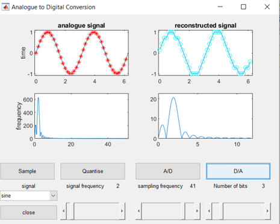
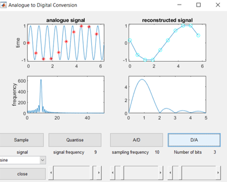

# aToD:  Analogue To Digital Conversion
A simple and intuitive graphical user interface to explore and analyse the process of analogue to digital conversion

<h2 id="2">Start the Graphical User Interface aToD</h2>

Call aToD from the command line without any arguments

<pre class="codeinput"> aToD
boxPlot3D(xx)
</pre>

aToD will create a graphical user interface. Initially, the interface gives you the option to select a type of signal (<i>sine, triangular or square</i>) or to change the frequency. When you select either of these two options, a signal will be drawn. 

You can change the type of signal or its frequency at any time.

You will have now two more options, related with the sampling of the signal. If you select these, the signal will be sampled.

